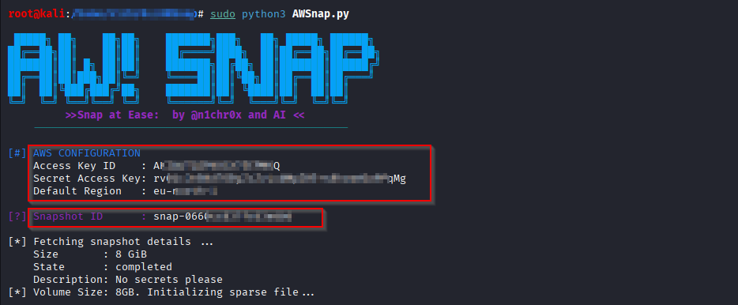

# AWSnap - **EBS Snapshot Triage & Smart Exfiltration**
**Author:** @n1chr0x  
**License:** MIT

**AWSnap** is an offensive security tool built for the "Smash & Grab" phase of a cloud engagement. It allows you to mount and browse AWS EBS Snapshots locally in seconds by downloading only the critical bits of data (Metadata & Inodes).

---
## 🧠 The Philosophy: Efficiency through Minimalist Access

AWSnap was born from a simple realization: **Traditional snapshot analysis is cumbersome.** The standard "Attach-to-EC2" workflow requires:
1. Creating a volume from a snapshot.
2. Launching or identifying a target EC2 instance.
3. Attaching the volume.
4. Managing Linux mount points and permissions.

**AWSnap bypasses the entire infrastructure layer.** By utilizing the EBS Direct APIs, it treats the cloud snapshot like a local streaming device. This "Lazy-by-Design" approach isn't just about saving time—it’s about:
* **Zero Infrastructure Footprint:** No instances, no volume costs, no SSH management.
* **Forensic Integrity:** Read-only access by default without "touching" the AWS production environment.
* **Speed-to-Data:** Go from Snapshot ID to `ls -la` in seconds, not minutes.                                                                       

## 🚀 Why is AWSnap Special?

* **Smart Sampling:** It "slurps" the filesystem map (Inode tables) first, so you can `ls` the drive immediately.
* **Sparse File Magic:** It creates a virtual 100GB disk that takes up almost zero space on your computer until you start reading files.
* **Auto-Repair:** It automatically fixes "Corrupt GPT" headers and aligns partitions so you don't have to manually calculate offsets.
* **Low Footprint** Operates purely via EBS Direct APIs. No EC2 instances are launched, keeping your footprint tiny.

---

## 📊 AWSnap vs. Pacu (dsnap)

| Feature | Pacu (`ebs__download`) | **AWSnap** |
| :--- | :--- | :--- |
| **Speed** | 🐢 Slow | ⚡ **Fast** |
| **Storage** | Needs full disk space | **Uses almost zero space** |
| **Method** | Full Forensic Image | **Smart Triage / Sampling** |
| **Best For** | Deep Law Enforcement Work | **Red Teaming & Secret Hunting** |

---

## 🛠️ Easy Installation

We’ve made it simple for you. Just run the setup script to grab all the "hardware" and "software" tools you need.

```bash
# 1. Clone the repo
git clone [https://github.com/n1chr0x/AWSnap.git](https://github.com/n1chr0x/AWSnap.git)
cd AWSnap

# 2. Run the auto-setup (as root)
sudo chmod +x setup.sh
sudo ./setup.sh
```

## 🛠️ Step-by-Step Guide

### **Step 1: Connect to AWS**
Launch the tool and provide your IAM Keys and snapshot and AWSnap will start the "Smart Slurp."


### **Step 3: Explore the Files**
Once the progress bar hits 100%, your snapshot is mounted! You can now browse the drive just like a normal folder on your computer.


## ⚠️ Warning
Because this tool uses Sampling, very large files (like big databases or encrypted zip files) might be "holey." AWSnap is meant for finding SSH keys, config files, and credentials, not for full system backups.

## Happy Hunting! 🕵️♂️

